# Computational Methods for Human Identification from Degraded and Mixed DNA Samples

## Using Deep Learning and Probabilistic Genomic Inference

This project develops a computational genomics framework for forensic-style human identification from degraded and mixed DNA samples using large-scale population genotype data from the 1000 Genomes Project.

The goal is to investigate how genomic identity matching behaves under increasing uncertainty, missing data, and contributor mixtures using both classical similarity-based methods and deep learning approaches.

---

# Overview

Forensic DNA samples are frequently incomplete, degraded, noisy, or composed of DNA originating from multiple individuals. These conditions create major computational challenges for reliable human identification.

This project simulates realistic degradation and DNA mixture scenarios and evaluates genomic matching performance under varying uncertainty levels.

The framework combines:

- probabilistic genomic inference,
- cosine-similarity identity matching,
- entropy-based uncertainty estimation,
- PCA-based genomic visualization,
- and deep neural network embedding models.

---

# Dataset

- **1000 Genomes Project Phase 3**
- Chromosome 20 genotype VCF
- 2,504 individuals available
- MVP subset:
  - 10,000 SNPs
  - 100 individuals

---

# Methods

## Genomic Data Processing

- VCF genotype extraction using `scikit-allel`
- SNP matrix generation
- Genotype encoding into numerical genomic vectors

## DNA Degradation Simulation

Synthetic degradation was simulated using random SNP dropout across varying degradation levels:

- 10%
- 30%
- 50%
- 70%
- 90%

Missing SNPs were masked to emulate damaged forensic DNA samples.

## Mixed DNA Sample Simulation

Synthetic DNA mixtures were generated using weighted combinations of genomic profiles from multiple individuals.

Example mixture ratios:

- 50/50
- 70/30
- 90/10

## Identity Matching

- Cosine similarity–based genomic matching
- Top-match identification
- Confidence score estimation
- Entropy-based uncertainty analysis

## Dimensionality Reduction

Principal Component Analysis (PCA) was used to visualize:

- genomic clustering,
- mixed DNA positioning,
- latent genomic structure.

## Deep Learning Baseline

A neural network classifier was implemented in PyTorch to learn genomic embeddings from SNP vectors.

Architecture:

- Fully connected feed-forward network
- ReLU activations
- Cross-entropy optimization using Adam

---

# Key Results

- Identification accuracy remained highly robust up to approximately **50% SNP degradation**.
- Performance declined sharply at **70–90% degradation levels**.
- Balanced DNA mixtures produced the highest uncertainty and entropy.
- Dominant-contributor mixtures yielded stronger confidence scores.
- PCA visualization demonstrated clear separation between individuals and mixed genomic profiles.
- Deep learning models successfully learned latent genomic embeddings, though overfitting emerged under limited identity supervision.

---

# Figures

## Identification Accuracy Under DNA Degradation

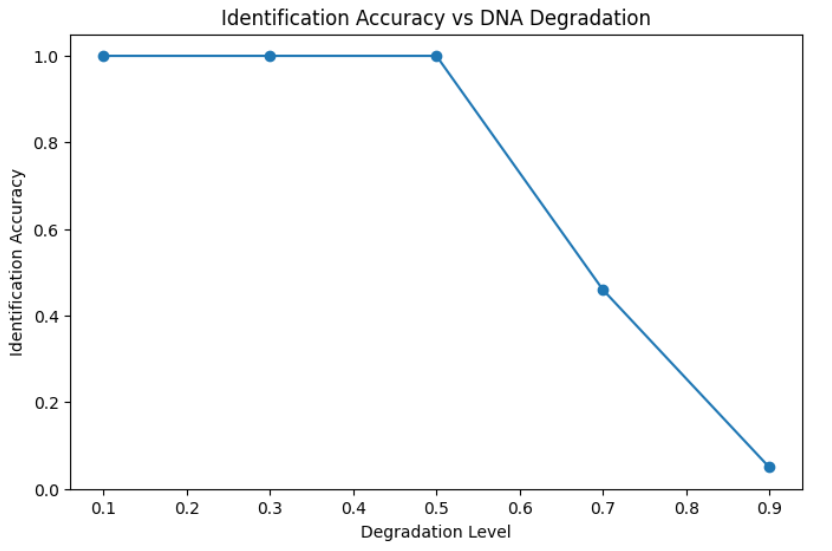

---

## Mixture Balance vs Entropy

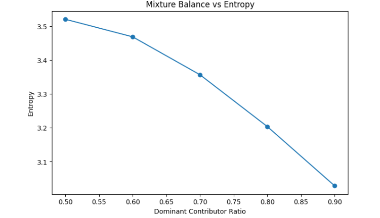

---

## PCA Visualization of Mixed DNA Samples

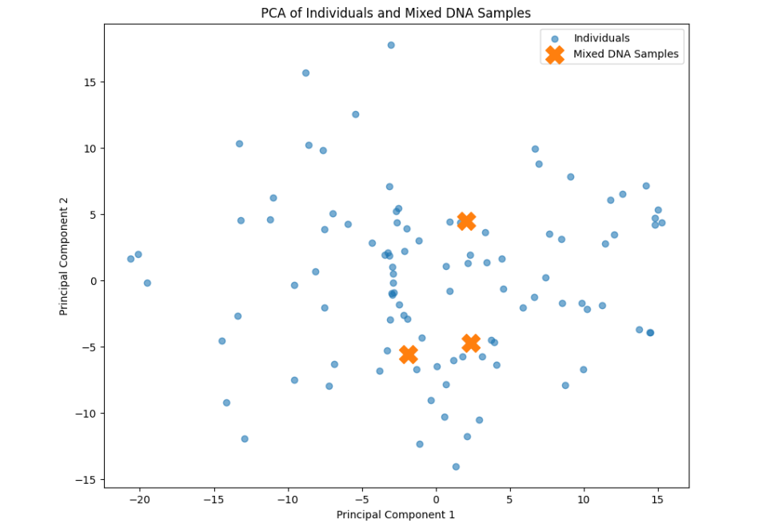

---

## Deep Genomic Embedding Space

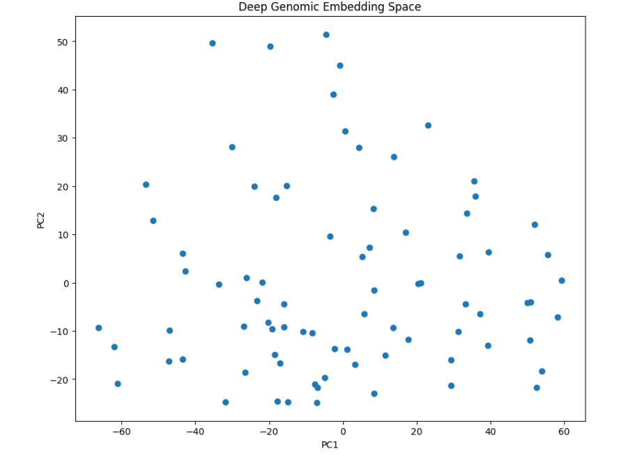

---

## Mixture Similarity Scores

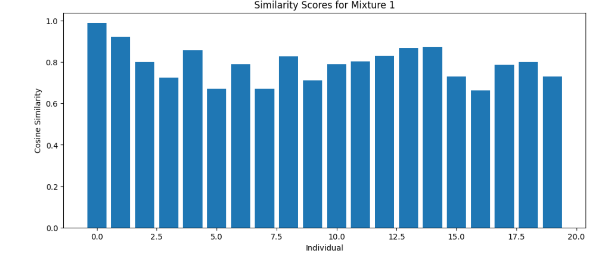

---

## Mean Genotype Distribution Across Individuals

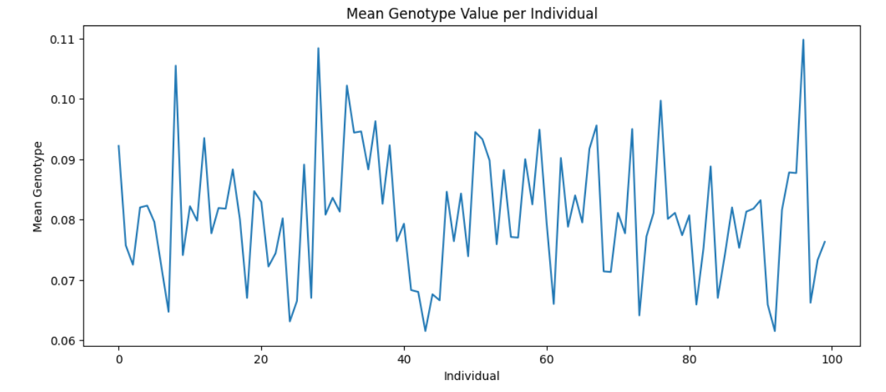

---

## Deep Learning Training Curve

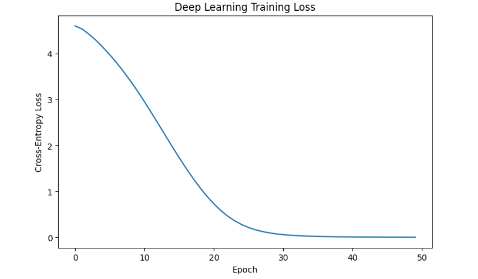

---

## Posterior Identity Probabilities


---

## ROC Curve for Genomic Identification


---

## Population-Aware Genomic Clustering

This PCA visualization demonstrates genomic clustering patterns across individuals from different populations in the 1000 Genomes Project.

Population labels reveal latent ancestry structure encoded in genomic variation.

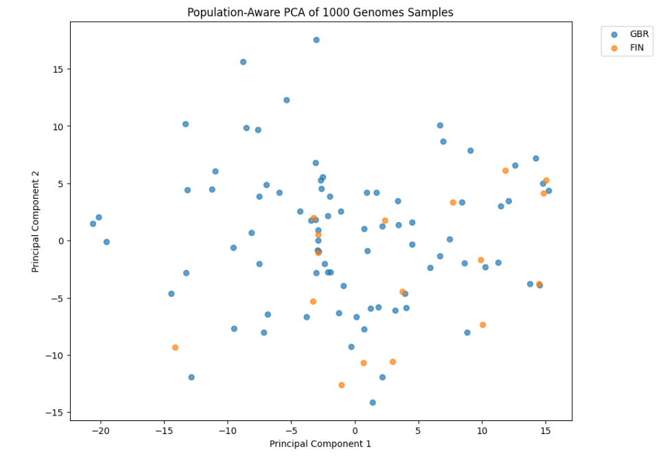

---

## Population Structure Visualization with UMAP

UMAP dimensionality reduction was applied to genomic SNP vectors to visualize latent ancestry structure across continental populations from the 1000 Genomes Project.

Distinct genomic clustering patterns emerged across:

- AFR
- AMR
- EAS
- EUR
- SAS

demonstrating that high-dimensional genomic variation preserves strong population-level structure.

### UMAP Embedding of Population Structure

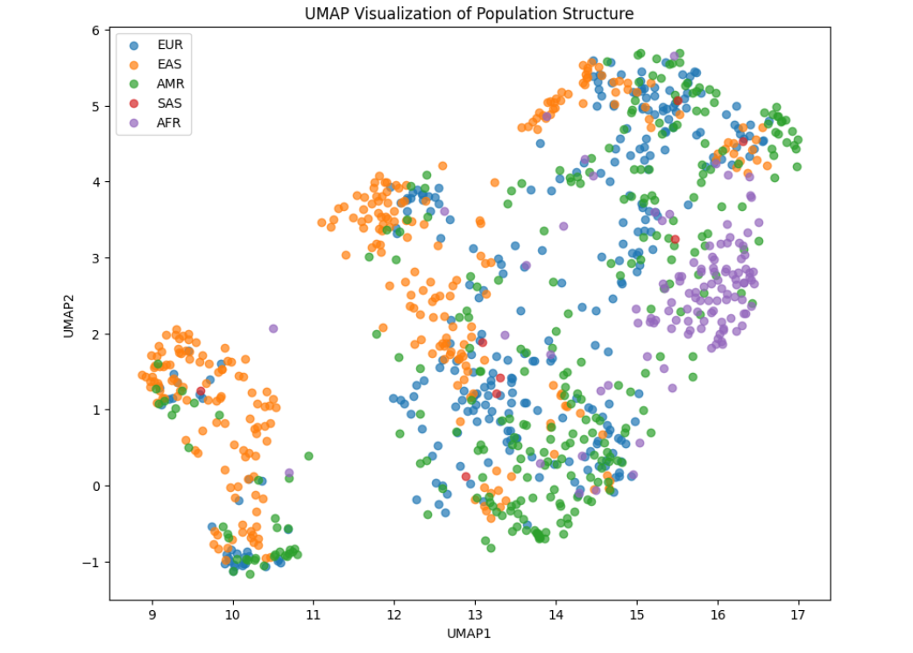

---

## Population-Aware Ancestry Inference

A supervised genomic ancestry classifier was trained using SNP vectors from the 1000 Genomes Project.

The model predicts continental ancestry groups:

- AFR
- AMR
- EAS
- EUR
- SAS

using genomic variation patterns extracted from chromosome 20.

The ancestry inference model achieved approximately **81% classification accuracy** using a Random Forest classifier trained on 10,000 SNPs across 1,000 individuals.

---

## Population-Aware Ancestry Inference

A supervised genomic ancestry classifier was trained using SNP vectors from the 1000 Genomes Project.

The model predicts continental ancestry groups:

- AFR
- AMR
- EAS
- EUR
- SAS

using genomic variation patterns extracted from chromosome 20.

The ancestry inference model achieved approximately **81% classification accuracy** using a Random Forest classifier trained on 10,000 SNPs across 1,000 individuals.

---

### Confusion Matrix


---

## Bayesian Posterior Identity Inference

Bayesian-style posterior probabilities were estimated from genomic similarity scores to quantify uncertainty in forensic identity assignment.

The probabilistic framework transforms cosine similarity evidence into normalized posterior identity distributions, enabling confidence-aware genomic matching under degraded and mixed DNA conditions.

---

### Posterior Identity Distribution

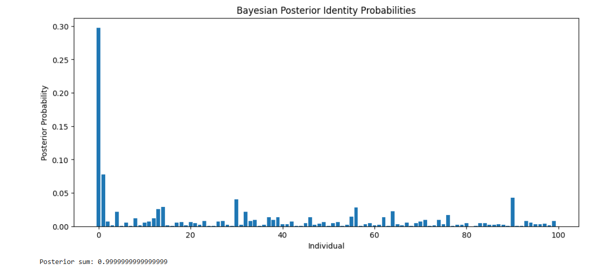

---

## Bayesian Identity Confidence and Uncertainty

Bayesian posterior probabilities and entropy metrics were used to quantify confidence and uncertainty in forensic genomic identity assignment.

Lower entropy corresponds to more confident identity predictions, while higher entropy reflects ambiguous or mixed genomic evidence.

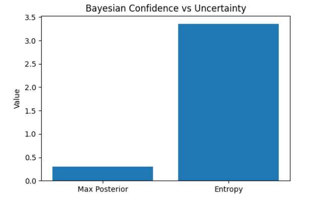

---

## Multiclass ROC Analysis

Receiver Operating Characteristic (ROC) analysis was performed for multiclass genomic ancestry inference.

The classifier demonstrated strong discriminative performance across continental ancestry groups using high-dimensional SNP variation.

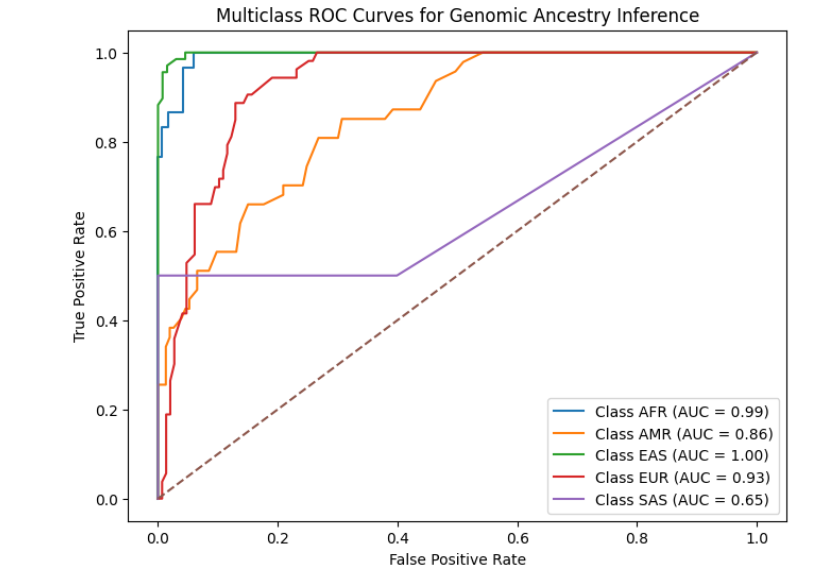

---

## Explainable Genomic AI

Feature importance analysis identified the most informative SNPs contributing to ancestry inference classification.

The analysis provides interpretable genomic markers associated with population structure and ancestry prediction.

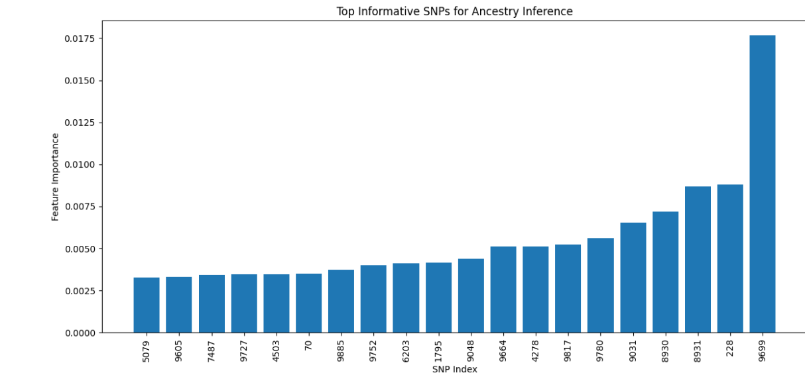

---

# Technologies Used

- Python
- NumPy
- SciPy
- scikit-learn
- scikit-allel
- Matplotlib
- PyTorch
- Jupyter Notebook

---

# Project Structure

```text
genomic_identification/
│
├── figures/
├── notebooks/
├── results/
├── src/
├── README.md
└── requirements.txt
```

---

# Future Directions

- Bayesian probabilistic genomic inference
- Transformer-based genomic embeddings
- Contrastive learning for identity matching
- Population-aware forensic inference
- Ancient DNA degradation modeling
- GPU-scale training on full 1000 Genomes datasets

---

# Author

**Agata Gabara**

Computational Genomics / Bioinformatics / Machine Learning  
Vrije Universiteit Amsterdam
